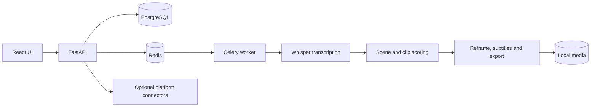

# Shorts Studio

Local-first toolkit for turning long videos into polished vertical clips.

Shorts Studio combines transcription, scene analysis, clip ranking, reframing,
subtitles and export in one reproducible pipeline. Heavy processing runs locally,
and external publishing stays disabled until it is explicitly configured.

## Highlights

- Local transcription with faster-whisper and VAD
- Scene detection and multimodal clip scoring
- Automatic 9:16 reframing with face and motion tracking
- Word-level animated subtitles
- Profanity detection and audio masking
- H.264/AAC export with loudness normalization
- Resumable processing stages
- Optional YouTube, TikTok and Instagram connectors
- Windows desktop launcher and Docker-based web stack
- Dry-run publishing by default

## Architecture



## Stack

- Python 3.12, FastAPI, SQLAlchemy and Celery
- faster-whisper, PySceneDetect and OpenCV
- FFmpeg and yt-dlp
- React 19, TypeScript and Vite
- PostgreSQL and Redis
- Docker Compose

## Repository layout

```text
backend/
  app/       processing pipeline, API and platform connectors
  tests/     unit and integration tests
frontend/
  src/       React interface
tools/       packaging and validation helpers
desktop_app.py
docker-compose.yml
```

## Run with Docker

Requirements: Docker Desktop, at least 8 GB of RAM, and enough free disk space
for source media, models and rendered clips.

```powershell
Copy-Item .env.example .env
docker compose up --build
```

Open `http://localhost:3000`. API documentation is available at
`http://localhost:3000/api/docs`.

The first transcription run downloads the selected Whisper model. Set
`WHISPER_MODEL` in `.env` to balance speed and accuracy.

## Run the tests

```powershell
docker compose run --rm api sh -lc "pip install '.[dev]' && pytest -q"
docker compose run --rm frontend npm run build
```

## Platform credentials

Copy `.env.example` to `.env` and add credentials only on your own machine.
The `.env` file is ignored by Git. Real external publishing remains disabled
while `REAL_PUBLISHING_ENABLED=false`.

Use the software only with media you own or have permission to process. Platform
connectors do not bypass authorization, access controls or platform safeguards.

